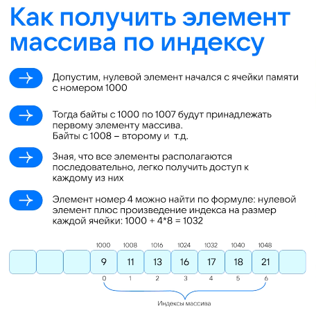

# Массив - непрерывная область памяти заданного размера, хранит однотипные данные, доступ через индекс, **доступ к элементы за O(1)**

## Структура
    size - количество элементов
    capacity - объем массива (size <= capacity)
    type - тип данных

## Array: 
    size int
    capacity int
    type int

# Основные операции над элемннтами массивом и их сложность
    get(index) - получение элемента по индексу, O(1)
    append() - вставка в конец, O(1)
    remove(index) - удаление элемента из массива, O(n)

                          